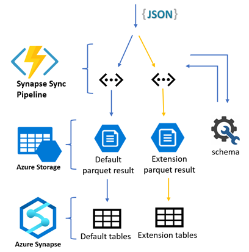

# Process FHIR extensions  

 

## Generate parquet data for FHIR extensions

### 1.	Prepare the customized schema templates
For each resource types, E.g. Patient, Observation, you need to prepare a **liquid template** and a related **JSON schema** file.
- The liquid template will be used to convert the raw FHIR JSON data into target structure.
- The JSON schema will be used to generate the Parquet schema and create table definitions.

Follow the links for more information about [liquid template](http://dotliquidmarkup.org/) and [JSON schema](https://json-schema.org/learn/getting-started-step-by-step).

Example liquid template and JSON schema for “Patient” resource, flatten the “birthplace” extension for analytics.

_Liquid template:_

_JSON schema file:_

**Note**:
1.	The JSON schema files must be saved at **Schema** directory in the image.
2.	 
4.	The “validate” tag in template is optional, we recommend to use this in your liquid template.
5.	You can firstly test your templates and schema files, then start to deploy the analytics pipeline, so as to avoid the potential issues.

### 2.	Push the customized schema to Azure Container Registry
Refer [here](https://github.com/microsoft/FHIR-Converter/blob/main/docs/TemplateManagementCLI.md) to push the prepared schema to Azure Container Registry, later we will use the schema image reference from the Container Registry to deploy the analytics pipeline.

### 3.	Deploy the Analytics pipeline with customized schema enabled
Deploy the pipeline with [ARM template](https://github.com/microsoft/FHIR-Analytics-Pipelines/blob/main/FhirToDataLake/deploy/templates/FhirSynapsePipelineTemplate.json), set up the “Customized Schema” as “true”, and “Customized Schema Image Reference” as the reference of your schema image.

 

After deploying the pipeline, the Azure Function agent will try to pull the customized schema from the given image reference.

### 4.	Provide access of the Container Registry to the Azure Function
Go to the Azure Container Registry instance, add the **principal account** of Azure Function you just created as the **“AcrPull”** of the Container Registry.
 
 

 

### 5.	Verify customized data on the Storage

Customized data will be generated to “{resource type}_Customized” folder on the Storage.

Example customized patient Parquet data on the Storage.

 

 

## Query customized data on Synapse Serverless SQL pool

### 1.	Run the Powershell script to create the tables and views with customized schema image

Browse to the scripts folder under this path (..\FhirToDataLake\scripts).

Run the following PowerShell script.
./Set-SynapseEnvironment.ps1 -SynapseWorkspaceName "Synapse name" -Storage   "Storage name" -CustomizedSchemaImage "Schema image reference"

Example:
./Set-SynapseEnvironment.ps1 -SynapseWorkspaceName quwansynapsews0830  -Storage fhrtosynaps6mocz2elwbwg6  -CustomizedSchemaImage exampleacr.azurecr.io/customizedtemplate:extensiontemplates

### 2.	Query customized data on the Synapse SQL pool

 
